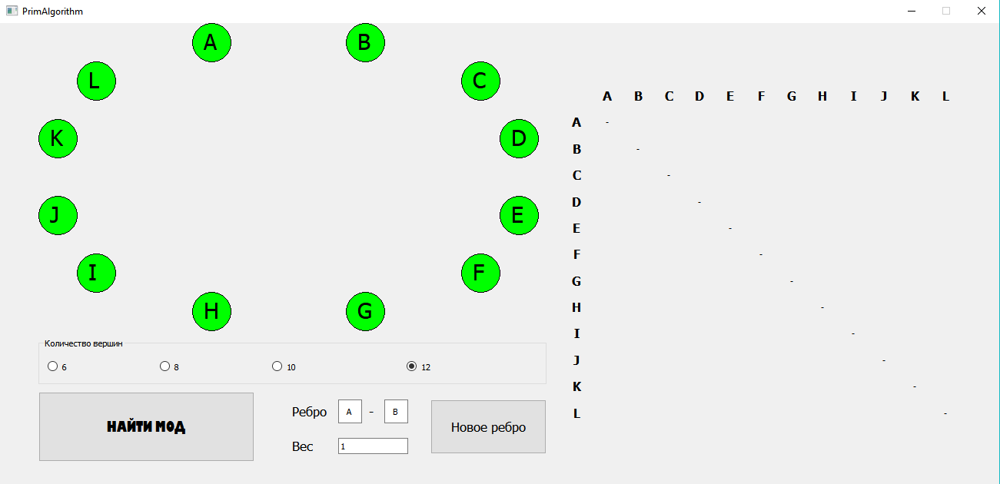
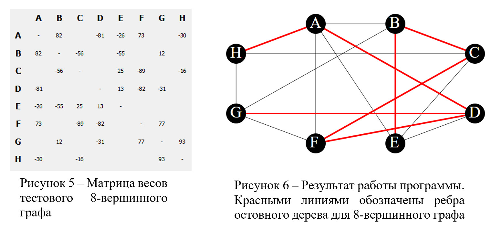

# РЕАЛИЗАЦИЯ АЛГОРИТМА ПРИМА ДЛЯ ПОИСКА МОД СВЯЗАННОГО ВЗВЕШЕННОГО НЕОРИЕНТИРОВАННОГО ГРАФА НА C++ Qt

Алгоритм Прима решает проблему построения сети с минимальными затратами. Суть этого метода заключается в последовательном добавлении к остову минимального, «безопасного» ребра (ребра, которое не образует цикла). В данной работе представлена программа, базирующаяся на алгоритме Прима, которая вычисляет минимальное остовное дерево неориентированного графа и делает визуализацию графа.

Для вывода итоговых и промежуточных результатов используется формат векторной графики SVG. Отображение вершин графа осуществляется по заранее подготовленным сеткам, выбранным в зависимости от количества вершин.

## Структура программы
#### Модуль отрисовки графа
- Coords – класс точек центра вершин графов
    - x
    - y
- Graph – класс графа
    - r – радиус вершин
    - capacity – количество вершин
    - VertexCoord[] – координаты центров вершин
- symbol[] – имена вершин графа
### Алгоритмический модуль
- matrix[][] - целочисленный массив для хранения матрицы весов исходного графа. Значения matrix[i][i] всегда равны 0. При отсутствии ребра между вершинами i и j будем также обнулять matrix[i][j].
- lightrows[] - логический массив, указывающий на номера вершин графа, включенных в остовное дерево.
- min – целочисленная переменная для поиска минимального по весу ребра.
- v1, v2 – целочисленные переменные для хранения номеров смежных вершин.
- SVGLightLines – строковая переменная для записи кода svg.
- allLinesIsNull() – функция, возвращающая логическое true, если все ячейки matrix[][] нулевые (т.е. для построения остовного дерева были задействованы все вершины исходного графа), иначе false.
- calc() – главная функция, которая будет запускаться после заполнения матрицы весов. Результатом ее работы будет .html файл с пошаговым отображением состояния остовного дерева исходного графа.

Первая вершина в матрице весов всегда будет корневой для искомого остовного дерева. Поэтому первым шагом будем выделять первую строку (lightrows[0] := true) и вычеркивать первый столбец (matrix[i][0] := 0) матрицы весов.

Затем циклично, пока не будут включены в остовное дерево все вершины исходного графа, будем выполнять следующие действия:
1. искать ненулевой min в выделенных строках (при равных весах потенциальных ребер для добавления в остовное дерево приоритет устанавливается слева направо и сверху вниз в соответствии с матрицей весов);
2. дополнить SVGLightLines кодом отрисовки нового ребра веса min, инцидентного вершинам v1 и v2;
3. выделить новую строку и вычеркнуть новый столбец.

## Как пользоваться
В окне программы необходимо выбрать количество вершин графа (6, 8, 10 или 12) и указать все ребра, вводя соответсвующие вершины и вес, кнопкой "Новое ребро". В окне программы будут отображаться таблица весов и графическое представление графа. Затем необходимо нажать кнопку "Найти МОД" для запуска алгоритма. В результате программа создает .html файл с svg-изображениями остовного дерева исходного графа на каждом шаге алгоритма. 

## Пример
